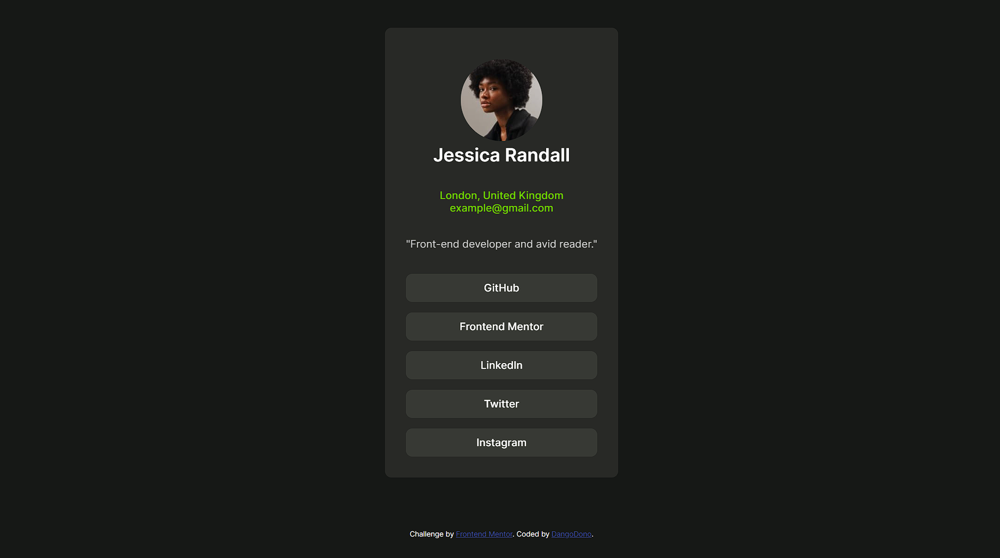

# Frontend Mentor - Social links profile solution

This is a solution to the [Social links profile challenge on Frontend Mentor](https://www.frontendmentor.io/challenges/social-links-profile-UG32l9m6dQ). Frontend Mentor challenges help you improve your coding skills by building realistic projects. 

## Table of contents

- [Overview](#overview)
  - [The challenge](#the-challenge)
  - [Screenshot](#screenshot)
  - [Links](#links)
- [My process](#my-process)
  - [Built with](#built-with)
  - [What I learned](#what-i-learned)
  - [Continued development](#continued-development)
  - [Useful resources](#useful-resources)
- [Author](#author)
- [Acknowledgments](#acknowledgments)

## Overview

### The challenge

Users should be able to:

- See hover and focus states for all interactive elements on the page

### Screenshot

### Links

- Solution URL: (https://github.com/CodingDango/frontendmentor-social-links-preview)
- Live Site URL:  (https://your-live-site-url.com)

## My process

### Built with

- Semantic HTML5 markup
- CSS custom properties
- Flexbox
- CSS Animations
- Mobile Responsiveness

### What I learned

Learned more about flexboxes, using flex grow to push the footer down onto the bottom of the screen. learned about animations, keyframes, and the like. and learned about responsiveness by using media queries. Learned more about keeping the HTML as semantic as i can. reducing the usage of divs and spans.

### Continued development

I am already satisfied with the challenge. i dont see anymore things to work on.